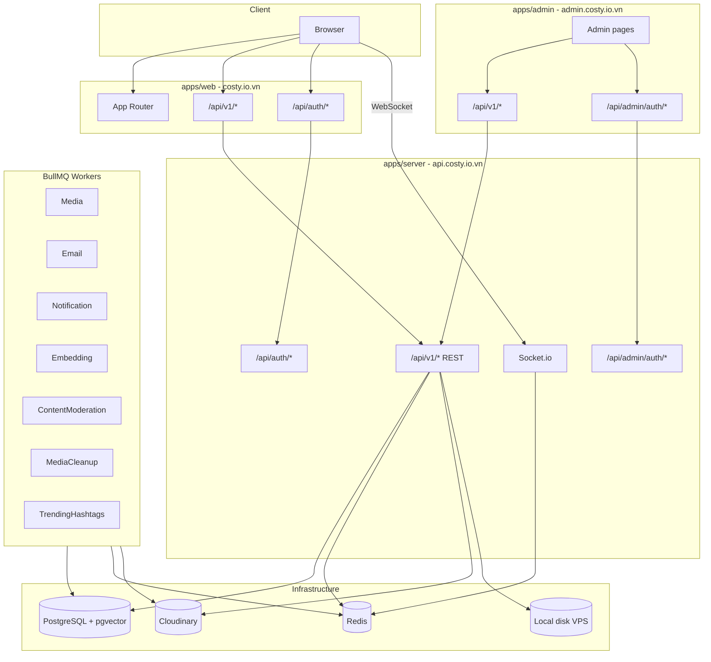
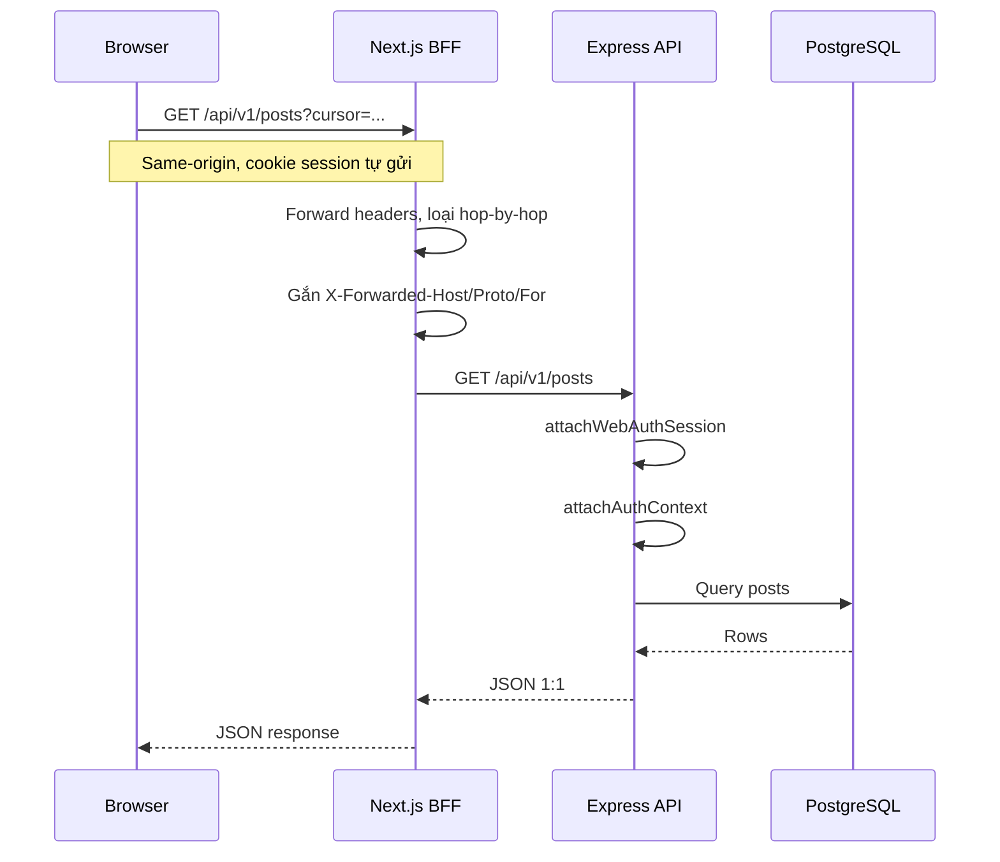
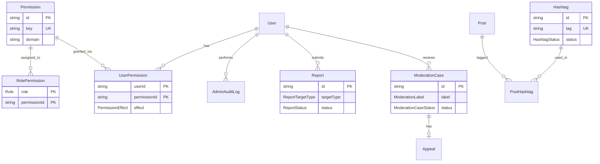
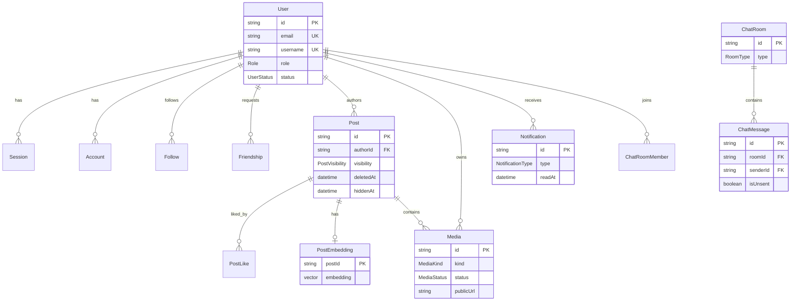

# Kiến trúc Costy

Tài liệu mô tả quyết định kiến trúc, luồng BFF, auth/RBAC, domain dữ liệu và các thành phần nền (realtime, workers, media). Chi tiết endpoint: [Swagger production](https://api.costy.io.vn/docs/).

## Tổng quan

Costy là ứng dụng mạng xã hội full-stack trên monorepo Turborepo + pnpm. Trình duyệt gọi Next.js cùng origin (**BFF**); Next proxy sang Express. Realtime qua Socket.io; việc nặng (embedding, moderation, cleanup) chạy BullMQ workers.

| Host production | Vai trò |
|---|---|
| [costy.io.vn](https://costy.io.vn/) | App người dùng (`apps/web`) |
| [admin.costy.io.vn](https://admin.costy.io.vn/) | Panel quản trị (`apps/admin`) |
| [api.costy.io.vn](http://api.costy.io.vn/) | Express API + Socket.io (`apps/server`) |

### Tech stack

| Lớp | Công nghệ |
|---|---|
| Monorepo | Turborepo + pnpm workspaces |
| Web / Admin | Next.js 16 (App Router), React 19, Tailwind, Radix, TanStack Query, Zustand, i18next |
| Backend | Express 4 (Node 22), Prisma, Pino, Zod, BullMQ, Socket.io, Helmet, Multer |
| Database | PostgreSQL 16 + pgvector |
| Cache / Queue | Redis (ioredis) + BullMQ |
| Auth | BetterAuth (credential + Google OAuth), cookie tách web/admin |
| Media | Cloudinary (post/avatar/cover) + đĩa VPS (chat) |
| AI | Embedding hybrid search + gpt-4o-mini content moderation |

### Cấu trúc thư mục

```
.
├── apps/
│   ├── web/        Next.js — BFF app người dùng
│   ├── admin/      Next.js — BFF panel quản trị
│   └── server/     Express API + Socket.io + BullMQ workers
├── packages/
│   ├── shared/     Types, Zod schemas, API envelope
│   ├── db/         Prisma schema, client, migrations, seed
│   ├── ui/         Shared UI utilities
│   ├── eslint-config/
│   └── typescript-config/
└── docker/
```

## Sơ đồ kiến trúc tổng thể



## Nguyên tắc thiết kế

1. **BFF same-origin** — Browser không gọi API trực tiếp từ origin khác; cookie session ổn định, tránh CORS, giữ IP client qua `X-Forwarded-*`.
2. **Hai cụm auth** — Web và Admin dùng BetterAuth riêng (`costy-web` / `costy-admin`), mount path khác nhau; không dùng chung session cookie.
3. **Module boundary** — Backend: `controller` / `service` / `routes` / `schema` / `types`. Frontend: feature folders (`components`, `hooks`, `queries`, `stores`).
4. **API envelope thống nhất** (`@costy/shared`) — `{ success, data, meta }` hoặc `{ success: false, error: { code, message } }`.
5. **Sync mỏng, async nặng** — REST xử lý request-response; embedding, moderation AI, cleanup media, trending đưa vào BullMQ.
6. **Realtime theo namespace** — Socket.io tách `/chat`, `/feed`, `/notifications`.

## Luồng BFF



Nguồn proxy: [`apps/web/app/api/v1/[...path]/route.ts`](../apps/web/app/api/v1/[...path]/route.ts), mount server: [`apps/server/src/app.ts`](../apps/server/src/app.ts).

## Auth & RBAC

### Hai cụm BetterAuth

| Cụm | Cookie namespace | Mount Express | Proxy từ |
|---|---|---|---|
| Web user | `costy-web` | `/api/auth/*` | `apps/web` → `/api/auth/*` |
| Admin panel | `costy-admin` | `/api/admin/auth/*` | `apps/admin` → `/api/admin/auth/*` |

Middleware trên `/api/v1/*`:

- Route thường: `attachWebAuthSession` → `attachAuthContext` → `blockInactiveUsers`
- Route admin (`/api/v1/admin/*`): `attachAdminAuthSession` → `requireAdminPanelAccess` / `requirePermission`

### Role & quyền

| Role | Panel admin | Quyền hiệu lực |
|---|---|---|
| `USER` | Không | Post, comment, react, follow, chat, report, sửa profile |
| `MODERATOR` | Có | Thêm `stats:view`, `report:read`, `report:review`, `post:hide` |
| `ADMIN` | Có | Wildcard `*` |
| `SUPER_ADMIN` | Có | Wildcard `*`; thêm hierarchy (đổi role/status ADMIN, bảo vệ SUPER_ADMIN) |

Nhóm permission domain (catalog đầy đủ trong code): `post`, `user`, `chat`, `report`, `stats`, `hashtag`, `admin` (`moderator:manage`, `permission:grant`, `audit:read`).

Nguồn: [`apps/server/src/lib/rbac/permission-catalog.ts`](../apps/server/src/lib/rbac/permission-catalog.ts). Tài khoản demo theo role: [`README.md`](../README.md).

## Domain & dữ liệu

Schema: [`packages/db/prisma/schema.prisma`](../packages/db/prisma/schema.prisma).

### RBAC & moderation



### Users, social & content



### Enum chính

| Enum | Giá trị |
|---|---|
| `Role` | `USER`, `MODERATOR`, `ADMIN`, `SUPER_ADMIN` |
| `UserStatus` | `ACTIVE`, `LOCKED`, `BANNED` |
| `PostVisibility` | `PUBLIC`, `FRIENDS`, `PRIVATE` |
| `ReportStatus` | `PENDING`, `UNDER_REVIEW`, `RESOLVED`, `DISMISSED`, `AUTO_HIDDEN` |
| `ModerationCaseStatus` | `PENDING`, `AUTO_HIDDEN`, `RESOLVED_KEPT`, `RESOLVED_REMOVED`, `DISMISSED` |
| `HashtagStatus` | `ACTIVE`, `HIDDEN`, `BLOCKED` |
| `FriendStatus` | `PENDING`, `ACCEPTED`, `REJECTED` |
| `RoomType` | `DIRECT`, `GROUP` |
| `MediaStatus` | `PENDING`, `PROCESSING`, `READY`, `FAILED` |
| `MediaKind` | `IMAGE`, `VIDEO`, `AVATAR` |

## Realtime & workers

### Socket.io

| Namespace | Mục đích | Sự kiện tiêu biểu |
|---|---|---|
| `/chat` | Tin nhắn 1-1 & nhóm | `message:new`, `message:reaction`, `room:created`, presence |
| `/feed` | Cập nhật feed | `post:reacted`, `post:updated`, `post:deleted` |
| `/notifications` | Thông báo push | `notification:new` |

Handshake: client lấy token qua `POST /api/v1/chat/socket-token` rồi connect. Nguồn: [`apps/server/src/socket/socket.ts`](../apps/server/src/socket/socket.ts).

### BullMQ

| Queue | Trạng thái | Mục đích |
|---|---|---|
| `Media` | Skeleton (noop) | Dự phòng xử lý media nền |
| `Email` | Skeleton (noop) | Dự phòng gửi mail |
| `Notification` | Skeleton (noop) | Dự phòng thông báo nền |
| `MediaCleanup` | Active | Dọn file chat hết hạn trên đĩa VPS |
| `TrendingHashtags` | Active | Tính hashtag trending |
| `ContentModeration` | Active | AI kiểm duyệt bài viết |
| `Embedding` | Active | Vector embedding hybrid search |

Nguồn: [`apps/server/src/workers/index.ts`](../apps/server/src/workers/index.ts).

## Media

| Loại | Lưu trữ | Dùng cho |
|---|---|---|
| Ảnh/video bài viết, avatar, cover | Cloudinary | Post, profile |
| File đính kèm chat | Đĩa local VPS + cleanup worker | Chat media có `expiresAt` |

## Error envelope

**Thành công:**

```json
{
  "success": true,
  "data": {},
  "meta": { "nextCursor": "...", "total": 42 }
}
```

**Lỗi:**

```json
{
  "success": false,
  "error": {
    "code": "NOT_FOUND",
    "message": "Không tìm thấy bài viết"
  }
}
```

## Bề mặt API

Browser gọi `/api/v1/*` qua BFF (web hoặc admin). Upstream Express phục vụ cùng path trên [api.costy.io.vn](http://api.costy.io.vn/).

Tài liệu đầy đủ (method, schema, auth): **[https://api.costy.io.vn/docs/](https://api.costy.io.vn/docs/)**.

Nhóm route chính:

| Nhóm | Path prefix | Ghi chú |
|---|---|---|
| Health | `/api/v1/health` | Liveness + Postgres/Redis |
| Auth web | `/api/auth/*` | BetterAuth web |
| Auth admin | `/api/admin/auth/*` | BetterAuth admin |
| Posts | `/api/v1/posts` | Feed, reels, comment, react, save, share |
| Users | `/api/v1/users` | Profile, follow, feed cá nhân |
| Friends | `/api/v1/friends` | Kết bạn |
| Chat | `/api/v1/chat` | Rooms, messages, socket-token |
| Search | `/api/v1/search` | Hybrid posts + users + hashtags |
| Notifications | `/api/v1/notifications` | Danh sách & đọc |
| Me | `/api/v1/me` | Profile, avatar, cover, saved, appeal |
| Reports | `/api/v1/reports` | Báo cáo vi phạm |
| Media | `/api/v1/media` | Upload chat + static serve |
| Admin | `/api/v1/admin` | Stats, users, reports, moderation, hashtags, RBAC, audit |

## Triển khai

- **Monorepo** Turborepo: `pnpm dev`, `pnpm build`, `pnpm type-check` / `lint` / `test`.
- **Docker**: compose + env tách [`docker/.env.docker`](../docker/.env.docker); image multi-stage gom web, API, workers — xem [`docker/README.md`](../docker/README.md).
- **Seed demo**: `pnpm db:seed` / `pnpm db:seed:accounts` — tài khoản demo trong [`README.md`](../README.md).
