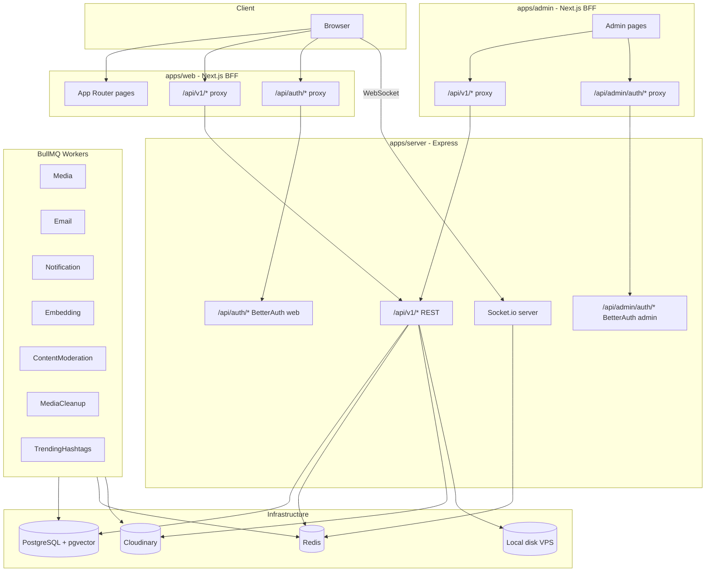
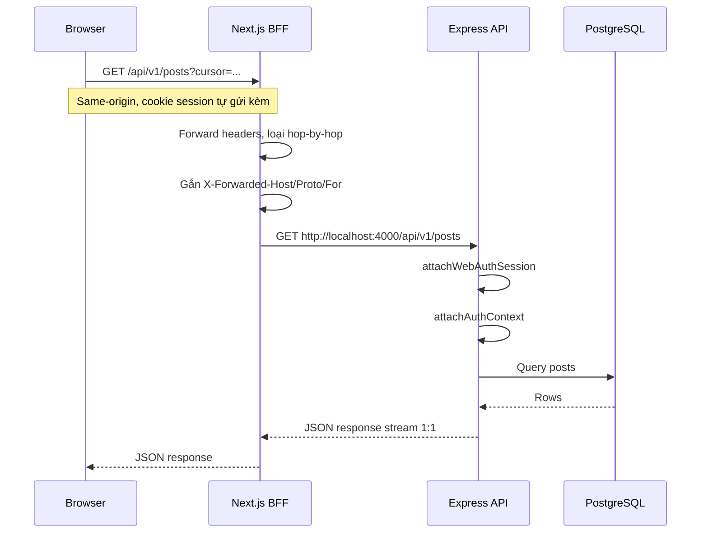
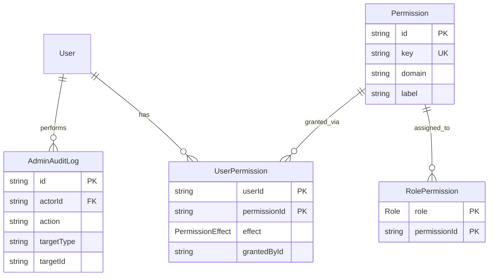
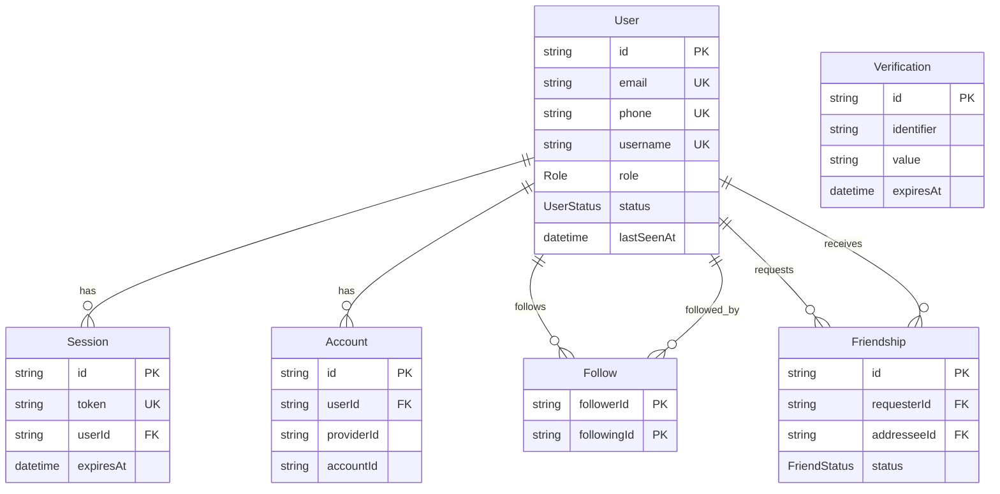
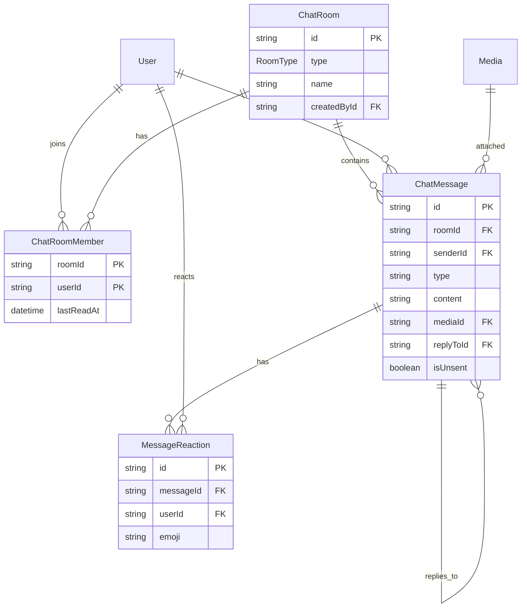
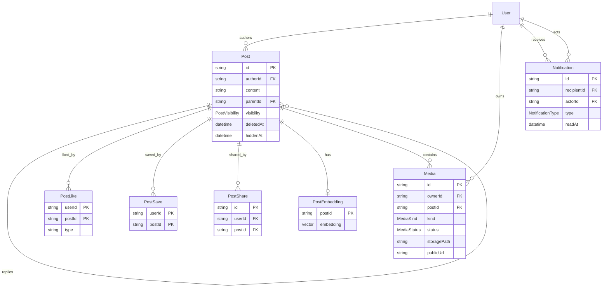

# Kiến trúc Costy

Tài liệu mô tả kiến trúc tổng thể, luồng BFF, sơ đồ cơ sở dữ liệu và danh sách API endpoints chính của dự án Costy.

## Tổng quan

Costy là ứng dụng mạng xã hội full-stack, tổ chức theo monorepo Turborepo + pnpm workspaces. Frontend (Next.js) đóng vai trò **BFF (Backend-for-Frontend)**, proxy các request API tới Express backend. Realtime qua Socket.io; xử lý nền qua BullMQ workers.

### Tech stack

| Lớp | Công nghệ |
|---|---|
| Monorepo | Turborepo + pnpm workspaces |
| Frontend (web) | Next.js 16 (App Router), React 19, Tailwind, Radix UI, `@costy/ui`, TanStack Query, Zustand, react-hook-form/Zod, i18next, socket.io-client |
| Admin | Next.js 16 (`apps/admin`, port 3001), Recharts, Radix UI — BFF riêng cho panel quản trị |
| Backend | Express 4 (Node 22), Prisma, Pino, Zod, BullMQ, Socket.io, Helmet, Multer |
| Database | PostgreSQL 16 + pgvector |
| Cache / Queue | Redis (ioredis) + BullMQ |
| Auth | BetterAuth (Google OAuth + email/username + password) |
| Realtime | Socket.io (namespaces `/chat`, `/feed`, `/notifications`) |
| Media | Cloudinary (ảnh/video bài viết, avatar, cover) + upload local đĩa VPS cho chat |
| AI | Vercel AI Gateway + OpenAI (embedding hybrid search, gpt-4o-mini content moderation) |
| Mail | Nodemailer |
| i18n | i18next (vi mặc định, en fallback) |

### Cấu trúc thư mục

```
.
├── apps/
│   ├── web/        Next.js frontend (BFF cho Express API)
│   ├── admin/      Next.js admin dashboard (BFF riêng)
│   └── server/     Express API + Socket.io + BullMQ workers
├── packages/
│   ├── shared/     Shared TS types, Zod schemas, API envelope
│   ├── db/         Prisma schema, client, migrations
│   ├── ui/         Shared UI utilities (cn, tokens)
│   ├── eslint-config/
│   └── typescript-config/
└── docker/
    ├── Dockerfile
    └── docker-compose.yml
```

## Sơ đồ kiến trúc tổng thể



## Luồng BFF

Trình duyệt **không** gọi trực tiếp Express (`localhost:4000`). Mọi request đi qua Next.js cùng origin để cookie session hoạt động đúng, tránh CORS và giữ IP thật của client qua header `X-Forwarded-*`.



### Hai cụm auth riêng biệt

| Cụm | Cookie namespace | Mount trên Express | Proxy từ |
|---|---|---|---|
| Web user | `costy-web` (BetterAuth web) | `/api/auth/*` | `apps/web` → `/api/auth/*` |
| Admin panel | `costy-admin` (BetterAuth admin) | `/api/admin/auth/*` | `apps/admin` → `/api/admin/auth/*` |

Middleware session trên `/api/v1/*`:

- Route thường: `attachWebAuthSession` → `attachAuthContext` → `blockInactiveUsers`
- Route admin (`/api/v1/admin/*`): `attachAdminAuthSession` → permission guards (`requireAdminPanelAccess`, `requirePermission`)

Nguồn: [`apps/web/app/api/v1/[...path]/route.ts`](../apps/web/app/api/v1/[...path]/route.ts), [`apps/server/src/app.ts`](../apps/server/src/app.ts)

## Sơ đồ cơ sở dữ liệu (ERD)

Sinh từ [`packages/db/prisma/schema.prisma`](../packages/db/prisma/schema.prisma).

### RBAC & Admin



### Moderation & Hashtag

```mermaid
erDiagram
    User ||--o{ Report : submits
    User ||--o{ Report : reviews
    User ||--o{ ModerationCase : author
    User ||--o{ ModerationCase : reviews
    User ||--o{ Appeal : submits
    ModerationCase ||--o| Appeal : has
    Post ||--o{ PostHashtag : tagged
    Hashtag ||--o{ PostHashtag : used_in

    Report {
        string id PK
        string reporterId FK
        ReportTargetType targetType
        string targetId
        ReportReason reason
        ReportStatus status
    }

    ModerationCase {
        string id PK
        ReportTargetType targetType
        string targetId
        string authorId FK
        ModerationLabel label
        float confidence
        ModerationCaseStatus status
    }

    Appeal {
        string id PK
        string caseId FK UK
        string userId FK
        AppealStatus status
    }

    Hashtag {
        string id PK
        string tag UK
        HashtagStatus status
    }

    PostHashtag {
        string postId PK
        string hashtagId PK
    }
```

### Users & Auth



### Chat



### Posts & Media



### Enum chính

| Enum | Giá trị |
|---|---|
| `Role` | `USER`, `MODERATOR`, `ADMIN`, `SUPER_ADMIN` |
| `UserStatus` | `ACTIVE`, `LOCKED`, `BANNED` |
| `PostVisibility` | `PUBLIC`, `FRIENDS`, `PRIVATE` |
| `ReportTargetType` | `POST`, `USER`, `COMMENT` |
| `ReportReason` | `SPAM`, `BULLYING`, `MINOR_SAFETY`, `SELF_HARM`, `VIOLENCE`, … |
| `ReportStatus` | `PENDING`, `UNDER_REVIEW`, `RESOLVED`, `DISMISSED`, `AUTO_HIDDEN` |
| `ModerationLabel` | `TOXIC`, `SPAM`, `HARASSMENT`, `HATE`, `SEXUAL`, `VIOLENCE`, … |
| `ModerationCaseStatus` | `PENDING`, `AUTO_HIDDEN`, `RESOLVED_KEPT`, `RESOLVED_REMOVED`, `DISMISSED` |
| `AppealStatus` | `PENDING`, `APPROVED`, `REJECTED` |
| `HashtagStatus` | `ACTIVE`, `HIDDEN`, `BLOCKED` |
| `FriendStatus` | `PENDING`, `ACCEPTED`, `REJECTED` |
| `RoomType` | `DIRECT`, `GROUP` |
| `MediaStatus` | `PENDING`, `PROCESSING`, `READY`, `FAILED` |
| `MediaKind` | `IMAGE`, `VIDEO`, `AVATAR` |
| `NotificationType` | `POST_LIKED`, `POST_REPLIED`, `USER_FOLLOWED`, `FRIEND_REQUEST`, `MESSAGE_RECEIVED`, … |

## Realtime & Workers

### Socket.io namespaces

| Namespace | Mục đích | Sự kiện tiêu biểu |
|---|---|---|
| `/chat` | Tin nhắn 1-1 & nhóm | `message:new`, `message:reaction`, `room:created`, presence |
| `/feed` | Cập nhật feed realtime | `post:reacted`, `post:updated`, `post:deleted` |
| `/notifications` | Thông báo push | `notification:new` |

Client lấy token handshake qua `POST /api/v1/chat/socket-token` trước khi connect.

Nguồn: [`apps/server/src/socket/socket.ts`](../apps/server/src/socket/socket.ts)

### BullMQ workers

| Queue | Mục đích |
|---|---|
| `Media` | Skeleton (noop) — dự phòng xử lý media nền |
| `Email` | Skeleton (noop) — dự phòng gửi email qua Nodemailer |
| `Notification` | Skeleton (noop) — dự phòng thông báo nền |
| `MediaCleanup` | Dọn file chat hết hạn trên đĩa VPS |
| `TrendingHashtags` | Tính hashtag trending |
| `ContentModeration` | AI kiểm duyệt nội dung bài viết (Vercel AI Gateway + gpt-4o-mini) |
| `Embedding` | Sinh vector embedding cho hybrid search (OpenAI text-embedding-3-small) |

Nguồn: [`apps/server/src/workers/index.ts`](../apps/server/src/workers/index.ts)

## Error envelope

Mọi API response tuân theo envelope thống nhất từ `@costy/shared`:

**Thành công:**

```json
{
  "success": true,
  "data": { ... },
  "meta": { "nextCursor": "...", "total": 42 }
}
```

**Lỗi:**

```json
{
  "success": false,
  "error": {
    "code": "NOT_FOUND",
    "message": "Không tìm thấy bài viết"
  }
}
```

## Danh sách API endpoints

Base URL phía browser: `/api/v1/*` (qua Next BFF). Base URL upstream Express: `http://localhost:4000/api/v1/*`.

Swagger UI (dev): <http://localhost:4000/docs>

### Health

| Method | Path | Auth | Mô tả |
|---|---|---|---|
| `GET` | `/api/v1/health` | Không | Liveness + kiểm tra Postgres & Redis |

### Auth (ngoài `/api/v1`)

| Method | Path | Mô tả |
|---|---|---|
| `POST` | `/api/auth/sign-in/identifier` | Đăng nhập bằng email/username + password |
| `*` | `/api/auth/*` | BetterAuth web (sign-up, OAuth, get-session, sign-out…) |
| `*` | `/api/admin/auth/*` | BetterAuth admin (cookie namespace riêng) |

### Posts — `/api/v1/posts`

| Method | Path | Auth | Mô tả |
|---|---|---|---|
| `GET` | `/posts/reels` | Tùy chọn | Feed reels (video), phân trang cursor |
| `GET` | `/posts` | Tùy chọn | Home feed (bài gốc) |
| `POST` | `/posts` | Có | Tạo bài viết (multipart, kèm media) |
| `GET` | `/posts/:postId` | Tùy chọn | Chi tiết bài viết |
| `GET` | `/posts/:postId/root` | Không | Lấy ID bài gốc (đệ quy reply) |
| `GET` | `/posts/:postId/comments` | Tùy chọn | Danh sách comment |
| `PUT` | `/posts/:postId` | Có | Sửa nội dung / visibility |
| `DELETE` | `/posts/:postId` | Có | Xóa bài viết / comment |
| `PUT` | `/posts/:postId/reactions` | Có | Bày tỏ cảm xúc (like, love, haha…) |
| `POST` | `/posts/:postId/save` | Có | Lưu bài viết |
| `DELETE` | `/posts/:postId/save` | Có | Bỏ lưu |
| `POST` | `/posts/:postId/share` | Có | Chia sẻ (đếm lượt) |

### Users — `/api/v1/users`

| Method | Path | Auth | Mô tả |
|---|---|---|---|
| `GET` | `/users` | Có | Gợi ý user (picker/composer) |
| `GET` | `/users/:username` | Tùy chọn | Profile công khai |
| `GET` | `/users/:username/feed` | Tùy chọn | Feed trang cá nhân |
| `GET` | `/users/:username/posts` | Tùy chọn | Grid bài viết (ảnh/video) |
| `GET` | `/users/:username/likes` | Tùy chọn | Bài đã thích (chủ tài khoản) |
| `GET` | `/users/:username/followers` | Tùy chọn | Danh sách follower |
| `GET` | `/users/:username/following` | Tùy chọn | Danh sách đang follow |
| `POST` | `/users/:id/follow` | Có | Follow user |
| `DELETE` | `/users/:id/follow` | Có | Unfollow user |

### Friends — `/api/v1/friends`

| Method | Path | Auth | Mô tả |
|---|---|---|---|
| `GET` | `/friends` | Có | Danh sách bạn bè |
| `GET` | `/friends/requests` | Có | Lời mời đến / đã gửi (`?type=incoming\|outgoing`) |
| `POST` | `/friends/:userId/request` | Có | Gửi lời mời kết bạn |
| `DELETE` | `/friends/:userId/request` | Có | Hủy lời mời đã gửi |
| `POST` | `/friends/:userId/accept` | Có | Chấp nhận lời mời |
| `POST` | `/friends/:userId/reject` | Có | Từ chối lời mời |
| `DELETE` | `/friends/:userId` | Có | Hủy kết bạn |

### Chat — `/api/v1/chat`

| Method | Path | Auth | Mô tả |
|---|---|---|---|
| `POST` | `/chat/socket-token` | Có | Token handshake Socket.io `/chat` |
| `GET` | `/chat/conversations` | Có | Danh sách hội thoại |
| `POST` | `/chat/rooms` | Có | Tạo phòng 1-1 hoặc nhóm |
| `GET` | `/chat/rooms/:roomId/messages` | Có | Lịch sử tin nhắn |
| `POST` | `/chat/rooms/:roomId/read` | Có | Đánh dấu đã đọc |

### Search — `/api/v1/search`

| Method | Path | Auth | Mô tả |
|---|---|---|---|
| `GET` | `/search` | Không | Hybrid search bài viết (FTS + semantic RRF) |
| `GET` | `/search/users` | Tùy chọn | Tìm user theo tên/username |
| `GET` | `/search/hashtags` | Không | Tìm hashtag |

### Notifications — `/api/v1/notifications`

| Method | Path | Auth | Mô tả |
|---|---|---|---|
| `GET` | `/notifications` | Có | Danh sách thông báo (cursor) |
| `GET` | `/notifications/unread-count` | Có | Số thông báo chưa đọc |
| `POST` | `/notifications/read` | Có | Đánh dấu đã đọc (1 hoặc tất cả) |

### Me — `/api/v1/me`

| Method | Path | Auth | Mô tả |
|---|---|---|---|
| `PATCH` | `/me/profile` | Có | Cập nhật tên / bio |
| `POST` | `/me/avatar` | Có | Upload avatar (multipart → Cloudinary) |
| `POST` | `/me/cover` | Có | Upload ảnh bìa |
| `GET` | `/me/saved` | Có | Bài viết đã lưu |
| `GET` | `/me/moderation/cases/:id` | Có | Chi tiết case kiểm duyệt của mình |
| `POST` | `/me/moderation/cases/:id/appeal` | Có | Gửi kháng nghị |

### Reports — `/api/v1/reports`

| Method | Path | Auth | Mô tả |
|---|---|---|---|
| `POST` | `/reports` | Có | Gửi báo cáo vi phạm |

### Media — `/api/v1/media`

| Method | Path | Auth | Mô tả |
|---|---|---|---|
| `POST` | `/media/upload` | Có | Upload media chat (lưu local VPS) |

Static serve: `GET /api/v1/media/uploads/*` — phục vụ file đã upload.

### Admin — `/api/v1/admin`

Yêu cầu auth admin + permission tương ứng.

| Method | Path | Permission | Mô tả |
|---|---|---|---|
| `GET` | `/admin/me/permissions` | Panel access | Quyền của admin hiện tại |
| `GET` | `/admin/stats/overview` | `stats:view` | Tổng quan thống kê |
| `GET` | `/admin/stats/posts-per-day` | `stats:view` | Bài viết theo ngày |
| `GET` | `/admin/stats/active-users` | `stats:view` | User hoạt động theo ngày |
| `GET` | `/admin/stats/top-hashtags` | `stats:view` | Hashtag trending |
| `GET` | `/admin/users` | `user:read` | Danh sách user |
| `GET` | `/admin/users/:id` | `user:read` | Chi tiết user |
| `PATCH` | `/admin/users/:id/status` | `user:lock` | Khóa / ban user |
| `GET` | `/admin/reports` | `report:read` | Danh sách báo cáo |
| `GET` | `/admin/reports/:id` | `report:read` | Chi tiết báo cáo |
| `PATCH` | `/admin/reports/:id` | `report:review` | Cập nhật trạng thái báo cáo |
| `PATCH` | `/admin/reports/:id/action` | `report:review` | Thực thi hành động kiểm duyệt |
| `GET` | `/admin/moderation/cases` | `report:read` | Danh sách case AI |
| `GET` | `/admin/moderation/cases/:id` | `report:read` | Chi tiết case |
| `PATCH` | `/admin/moderation/cases/:id/action` | `report:review` | Xử lý case |
| `PATCH` | `/admin/moderation/cases/:id/appeal` | `report:review` | Duyệt kháng nghị |
| `GET` | `/admin/hashtags` | `hashtag:read` | Danh sách hashtag |
| `PATCH` | `/admin/hashtags/:id` | `hashtag:manage` | Ẩn / chặn hashtag |
| `GET` | `/admin/moderators` | `moderator:manage` | Danh sách moderator |
| `POST` | `/admin/moderators` | `moderator:manage` | Thăng cấp moderator |
| `GET` | `/admin/permissions` | `permission:grant` | Danh sách permission |
| `GET` | `/admin/users/:id/permissions` | `permission:grant` | Permission của user |
| `PUT` | `/admin/users/:id/permissions` | `permission:grant` | Gán / thu hồi permission |
| `GET` | `/admin/audit-logs` | `audit:read` | Nhật ký hành động admin |
